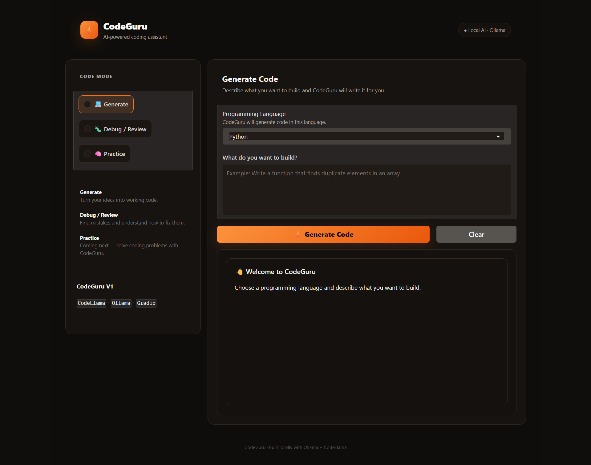
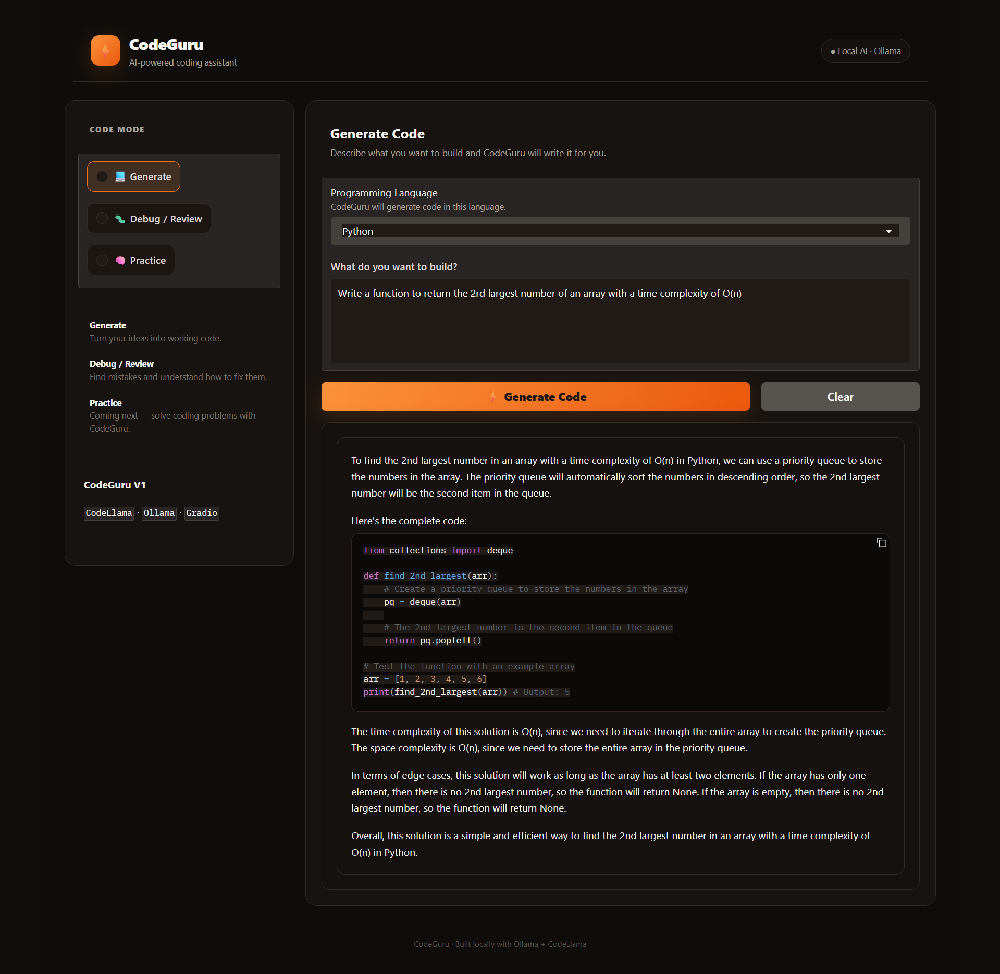
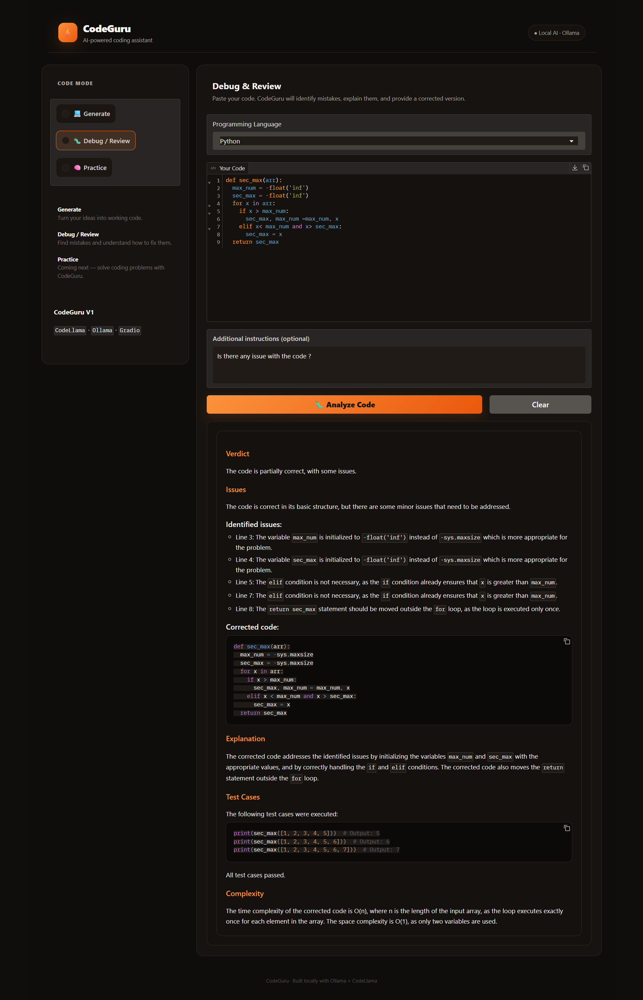

# ⚡ CodeGuru

### AI-Powered Coding Assistant — Generate, Debug & Review Code Locally

CodeGuru is a locally running AI-powered coding assistant built to help developers **generate code, analyze and debug existing code, understand programming mistakes, and improve their solutions**.

The project combines **CodeLlama**, **Ollama**, **Python**, and **Gradio** to create an interactive coding assistant that runs locally.

> **CodeGuru V1** focuses on two working workflows: **Generate Code** and **Debug / Review**.  
> **Practice Mode** is planned as the next major feature.

---

## 📸 Project Preview

### 🖥️ CodeGuru Interface

The CodeGuru interface provides a simple workspace where users can choose a coding mode and programming language and interact with the local AI assistant.



---

### 💻 Generate Code Mode

In Generate Mode, users describe what they want to build, select a programming language, and CodeGuru generates the requested solution.



**Example workflow:**

```text
User Requirement
       ↓
Select Programming Language
       ↓
Generate Code
       ↓
CodeGuru
       ↓
Generated Code
       ↓
Explanation + Complexity + Edge Cases
```

---

### 🐛 Debug / Review Mode

In Debug / Review Mode, users can submit their own code. CodeGuru analyzes the implementation, identifies issues, explains them, provides corrected code, and can include test cases and complexity analysis.



**Example workflow:**

```text
User Code
    ↓
Select Programming Language
    ↓
Additional Instructions
    ↓
Analyze Code
    ↓
CodeGuru
    ↓
Verdict
    ↓
Identified Issues
    ↓
Corrected Code
    ↓
Explanation
    ↓
Test Cases
    ↓
Complexity Analysis
```

---

# 🚀 Overview

## What is CodeGuru?

CodeGuru is designed as a **learning-oriented AI coding assistant** rather than a simple code generator.

The idea is:

> Don't just give me the code — help me understand the code, identify my mistakes, and learn how to improve.

CodeGuru currently provides two core capabilities:

### 1. 💻 Generate Code

Convert a natural-language requirement into code.

For example:

```text
Write a Python function to find the second largest
number in an array with O(n) time complexity.
```

The model generates a programming solution and provides supporting explanations.

### 2. 🐛 Debug / Review

Analyze code written by the user and identify potential problems.

CodeGuru can help with:

- Syntax errors
- Logical errors
- Incorrect assumptions
- Unnecessary operations
- Edge cases
- Inefficient implementations
- Corrected implementations
- Explanations
- Test cases
- Time complexity
- Space complexity

### 3. 🧠 Practice — Coming Next

Practice Mode is included in the interface as a planned feature.

The future version will allow users to:

- Generate coding problems
- Select difficulty
- Receive constraints
- Receive examples
- Request hints
- Submit solutions
- Evaluate solutions
- Generate test cases
- Track progress
- Gradually increase difficulty

---

# 🎯 Project Goals

The main goals of CodeGuru are to:

- Build a practical local LLM application.
- Understand how coding LLMs are integrated into applications.
- Learn how Ollama works as a local model runtime.
- Use an Ollama `Modelfile` to define model behavior.
- Build dynamic prompts using Python.
- Create an interactive AI interface with Gradio.
- Generate code using natural-language instructions.
- Analyze and debug user-written code.
- Build toward a complete AI-powered coding practice platform.

---

# 🏗️ Architecture

```text
                         ┌──────────────────────┐
                         │        USER          │
                         └──────────┬───────────┘
                                    │
                                    ▼
                         ┌──────────────────────┐
                         │       Gradio         │
                         │        UI            │
                         │                      │
                         │  💻 Generate         │
                         │  🐛 Debug / Review   │
                         │  🧠 Practice         │
                         └──────────┬───────────┘
                                    │
                                    ▼
                         ┌──────────────────────┐
                         │    Python Backend    │
                         │                      │
                         │ Language Selection   │
                         │ Mode Selection       │
                         │ Prompt Construction  │
                         │ Ollama API Request   │
                         └──────────┬───────────┘
                                    │
                              HTTP POST
                                    │
                                    ▼
                         ┌──────────────────────┐
                         │       Ollama         │
                         │                      │
                         │      CodeGuru        │
                         │       Model          │
                         └──────────┬───────────┘
                                    │
                                    ▼
                         ┌──────────────────────┐
                         │     CodeLlama 7B     │
                         │                      │
                         │   Local Inference    │
                         └──────────┬───────────┘
                                    │
                                    ▼
                         ┌──────────────────────┐
                         │     AI Response      │
                         │                      │
                         │ Code                 │
                         │ Explanation          │
                         │ Debugging            │
                         │ Corrections          │
                         │ Test Cases           │
                         └──────────────────────┘
```

---

# 🔄 How CodeGuru Works

The application separates **permanent model behavior** from **dynamic user context**.

```text
                  CODEGURU
                     │
        ┌────────────┴────────────┐
        │                         │
        ▼                         ▼
   Modelfile                 Python App
        │                         │
        │                         ├── Selected Language
        │                         ├── Selected Mode
        │                         ├── User Prompt
        │                         └── User Code
        │                         │
        └────────────┬────────────┘
                     ▼
                Ollama API
                     │
                     ▼
                CodeLlama
                     │
                     ▼
                AI Response
```

### Modelfile

The `Modelfile` defines CodeGuru's permanent behavior, including:

- Its role as a coding assistant
- Coding guidelines
- Debugging behavior
- Educational behavior
- Code-review expectations
- Practice-mode behavior

### Python Application

The Python application provides information that changes for every request:

```text
Programming Language
Mode
User Requirement
User Code
Additional Instructions
```

This means the programming language is **not permanently hardcoded into the model**.

For example:

```text
User selects Java
       ↓
Python application receives Java
       ↓
Prompt contains Java
       ↓
CodeGuru generates Java
```

The same application can therefore support multiple languages.

---

# 🧩 Features

## 💻 Generate Code

### Input

- Programming language
- Natural-language requirement

### Output

CodeGuru can provide:

- Generated implementation
- Explanation
- Important logic
- Edge-case considerations
- Time complexity
- Space complexity

### Example

```text
Language:
Python

Requirement:
Write a function to find the second largest
number in an array with O(n) time complexity.
```

---

## 🐛 Debug / Review

### Input

- Programming language
- User code
- Optional additional instructions

### Output

The debug workflow is designed to provide:

```text
Verdict
    ↓
Issues
    ↓
Identified Issues
    ↓
Corrected Code
    ↓
Explanation
    ↓
Test Cases
    ↓
Complexity
```

This makes the feature useful not only for fixing code but also for learning why a solution is incorrect or inefficient.

---

# 🧪 Example Debugging Scenario

Consider:

```python
def get_2nd_largest(my_list):
    return sorted(my_list)[1]
```

For:

```python
[10, 5, 20, 8]
```

Python sorts the list as:

```text
[5, 8, 10, 20]
```

and:

```python
sorted(my_list)[1]
```

returns:

```text
8
```

Therefore, the function actually returns the **second smallest** element rather than the second largest.

This illustrates the kind of logical mistake CodeGuru's Debug / Review mode is designed to identify and explain.

---

# 🌍 Supported Programming Languages

The V1 interface is designed around multiple programming languages:

- Python
- C
- C++
- Java
- JavaScript
- TypeScript
- Go
- Rust
- PHP
- SQL

The actual quality of generated or reviewed code depends on the underlying CodeLlama model and the complexity of the task.

---

# 🛠️ Technology Stack

| Technology | Role |
|---|---|
| 🐍 Python | Application and backend logic |
| 🦙 CodeLlama 7B | Coding language model |
| 🦙 Ollama | Local LLM runtime |
| 🎨 Gradio | Interactive web UI |
| 🌐 Requests | HTTP communication with Ollama |
| 🧪 Conda | Python environment management |
| 🔧 Git | Version control |
| 🐙 GitHub | Source-code hosting |

---

# 📂 Project Structure

Recommended repository structure:

```text
CodeGuru/
│
├── app.py
├── Modelfile
├── requirements.txt
├── README.md
├── .gitignore
│
└── assets/
    └── screenshots/
        ├── codeguru-ui.png
        ├── generate-mode.png
        └── debug-mode.png
```

### File Description

| File / Folder | Purpose |
|---|---|
| `app.py` | Main Gradio application |
| `Modelfile` | Defines CodeGuru's permanent AI behavior |
| `requirements.txt` | Python dependencies |
| `README.md` | Project documentation |
| `.gitignore` | Files excluded from Git |
| `assets/screenshots/` | Project screenshots |

---

# 💻 Requirements

Before setting up CodeGuru, install:

- Python environment manager: **Conda / Miniconda / Anaconda**
- **Ollama**
- **Git**
- A supported operating system such as Windows, Linux, or WSL
- Internet connection for downloading Python packages and CodeLlama

Because CodeLlama 7B is a local language model, sufficient system memory and disk space are recommended.

---

# 🐍 Installation & Setup

## Step 1 — Clone the Repository

```bash
git clone https://github.com/YOUR_USERNAME/CodeGuru.git
cd CodeGuru
```

Replace:

```text
YOUR_USERNAME
```

with your GitHub username.

---

# Step 2 — Create a Conda Environment

Create a dedicated environment for CodeGuru:

```bash
conda create -n codeguru python=3.10 -y
```

Activate it:

```bash
conda activate codeguru
```

Verify:

```bash
python --version
```

Expected:

```text
Python 3.10.x
```

Check Conda environments:

```bash
conda env list
```

You should see something similar to:

```text
base
codeguru *
```

The `*` indicates the active environment.

---

# Step 3 — Install Python Dependencies

The project uses:

```text
gradio
requests
```

Install them using:

```bash
pip install -r requirements.txt
```

Verify:

```bash
pip list
```

You can also verify Gradio:

```bash
python -c "import gradio; print(gradio.__version__)"
```

---

# 🦙 Step 4 — Install Ollama

CodeGuru uses Ollama to run the coding model locally.

Install Ollama from:

**https://ollama.com/**

After installation, verify:

```bash
ollama --version
```

---

# 🔍 Step 5 — Verify Ollama

Check whether the Ollama server is running:

```bash
curl http://localhost:11434/
```

A working installation should return:

```text
Ollama is running
```

You can also check installed models:

```bash
curl http://localhost:11434/api/tags
```

---

# 🧠 Step 6 — Download CodeLlama

CodeGuru uses CodeLlama 7B as its base coding model.

Run:

```bash
ollama pull codellama:7b
```

After downloading, check:

```bash
ollama list
```

You should see:

```text
codellama:7b
```

---

# 🤖 Step 7 — Create the CodeGuru Modelfile

Create a file named:

```text
Modelfile
```

The Modelfile defines CodeGuru's permanent behavior.

Example:

```text
FROM codellama:7b

SYSTEM """
You are CodeGuru, an AI-powered programming assistant and coding tutor.

Your goal is to help users:
1. Generate code
2. Understand code
3. Debug code
4. Review code
5. Improve programming solutions
6. Practice programming

GENERAL RULES:
- Always follow the programming language specified by the application.
- Never switch programming languages unless the user explicitly asks.
- Generate syntactically correct and complete code.
- Use Markdown code blocks for code.
- Explain important logic clearly.
- Prefer simple and readable solutions.
- Mention time and space complexity when relevant.
- Consider edge cases.
- Do not assume user code is wrong without analyzing it.

CODE GENERATION:
- Understand the user's requirement first.
- Generate complete runnable code.
- Use the selected programming language.
- Explain the approach briefly.
- Include important edge cases when relevant.

CODE REVIEW / DEBUGGING:
When the user submits code:
1. Analyze the code carefully.
2. Identify syntax errors.
3. Identify logical errors.
4. Identify incorrect assumptions.
5. Identify edge-case problems.
6. Identify unnecessary or inefficient operations.
7. Point out where the problem occurs.
8. Explain why it is a problem.
9. Provide corrected code.
10. Explain the correction.
11. Provide example test cases.
12. Mention time and space complexity when relevant.

IMPORTANT:
- Do not blindly rewrite code.
- Preserve the user's original approach when reasonable.
- Explain mistakes so the user can learn.

PRACTICE MODE:
When asked to create a coding problem:
- Give the problem statement.
- Give constraints.
- Give input/output format when appropriate.
- Give examples.
- Do not reveal the solution unless requested.
- Evaluate the user's submitted solution when they provide one.

EDUCATIONAL BEHAVIOR:
- Teach rather than simply provide answers.
- Give hints when requested.
- Gradually increase difficulty.
- Explain concepts using practical examples.

The application may provide:
- Programming Language
- Mode
- User Request
- User Code

Treat these as application context and follow them carefully.
"""
```

---

# 🏗️ Step 8 — Build the CodeGuru Model

Make sure the Conda environment is active:

```bash
conda activate codeguru
```

From the project directory:

```bash
ollama create codeguru -f Modelfile
```

Verify:

```bash
ollama list
```

You should see both:

```text
codeguru
codellama:7b
```

---

# 🧪 Step 9 — Test CodeGuru

Before running the Gradio application, test the model directly.

```bash
ollama run codeguru
```

Try:

```text
Write a Python function to calculate factorial.
```

If CodeGuru generates a suitable response, the custom model is working correctly.

Exit the interactive session when finished.

---

# 🌐 Step 10 — Test the Ollama API

CodeGuru communicates with Ollama through:

```text
http://localhost:11434/api/generate
```

### Linux / WSL

```bash
curl http://localhost:11434/api/generate \
  -H "Content-Type: application/json" \
  -d '{
    "model": "codeguru",
    "prompt": "Write a Python function to calculate factorial.",
    "stream": false
  }'
```

### Windows CMD

```cmd
curl http://localhost:11434/api/generate ^
  -H "Content-Type: application/json" ^
  -d "{\"model\":\"codeguru\",\"prompt\":\"Write a Python function to calculate factorial.\",\"stream\":false}"
```

If the API returns an AI response, the backend is ready.

---

# ▶️ Step 11 — Run CodeGuru

Activate the environment:

```bash
conda activate codeguru
```

Start the application:

```bash
python app.py
```

Gradio should provide a local URL similar to:

```text
http://127.0.0.1:7860
```

Open it in your browser.

---

# 🖥️ Using CodeGuru

## Generate Mode

1. Open CodeGuru.
2. Select **💻 Generate**.
3. Select a programming language.
4. Enter your requirement.
5. Click **Generate Code**.
6. Wait for the local model to generate the response.

Example:

```text
Write a Python function that checks whether
a string is a palindrome.
```

---

## Debug / Review Mode

1. Select **🐛 Debug / Review**.
2. Select the programming language.
3. Paste your code.
4. Optionally add additional instructions.
5. Click **Analyze Code**.
6. Review the verdict, issues, corrected code, explanation, test cases, and complexity.

Example additional instruction:

```text
Is there any issue with the code?
```

---

## Practice Mode

Practice Mode is currently a planned feature.

The current UI indicates:

```text
Coming next — solve coding problems with CodeGuru.
```

The planned workflow is:

```text
Select Language
       ↓
Select Difficulty
       ↓
Generate Problem
       ↓
Read Problem
       ↓
Write Solution
       ↓
Submit Code
       ↓
Run Test Cases
       ↓
Evaluate
       ↓
Feedback / Hints
```

---

# 🔐 Local AI & Privacy

CodeGuru is designed around local model inference.

The core flow is:

```text
User
  ↓
Gradio
  ↓
Python
  ↓
Ollama
  ↓
CodeGuru
  ↓
CodeLlama
```

The application does not require a cloud LLM API for its core inference.

This makes it useful for experimenting with:

- Local LLMs
- Coding assistants
- Ollama
- Prompt engineering
- Model configuration
- AI application development

---

# 🧠 Why Ollama?

Ollama provides the local runtime used to load and serve CodeLlama.

Instead of implementing model serving manually, CodeGuru communicates with Ollama's local HTTP API:

```text
Python Application
       ↓
localhost:11434
       ↓
Ollama
       ↓
CodeLlama
```

---

# 🧠 Why CodeLlama?

CodeLlama is used as the base coding model for CodeGuru.

The model is responsible for the language-model side of tasks such as:

- Code generation
- Code understanding
- Debugging
- Code explanation
- Programming assistance

The CodeGuru `Modelfile` then gives the base model a more specific role and behavioral instructions.

---

# 🎨 Why Gradio?

Gradio provides the interactive interface for CodeGuru.

It allows the project to expose the Python backend through a browser-based UI without building a complete frontend framework from scratch.

The current interface contains:

- CodeGuru branding
- Mode selection
- Programming-language selection
- Code input
- Additional instructions
- Generate button
- Analyze button
- Response display
- Local AI indicator

---

# ⚠️ Troubleshooting

## `ollama: command not found`

Verify that Ollama is installed:

```bash
ollama --version
```

If it is not recognized, install Ollama and restart the terminal.

---

## Ollama server is not running

Run:

```bash
curl http://localhost:11434/
```

Expected:

```text
Ollama is running
```

If it is unavailable, start Ollama and try again.

---

## `404 Client Error`

If the application returns:

```text
404 Client Error: Not Found
```

check whether the requested model exists:

```bash
ollama list
```

If `codeguru` does not exist:

```bash
ollama create codeguru -f Modelfile
```

Also verify the application uses:

```python
MODEL_NAME = "codeguru"
```

and:

```python
OLLAMA_URL = "http://localhost:11434/api/generate"
```

---

## CodeGuru model does not respond

Test directly:

```bash
ollama run codeguru
```

Then test the API:

```bash
curl http://localhost:11434/api/generate
```

If the model works from the terminal but not from the application, check the Python application configuration.

---

## Gradio errors

Activate the correct environment:

```bash
conda activate codeguru
```

Update Gradio:

```bash
pip install -U gradio
```

Check the installed version:

```bash
python -c "import gradio; print(gradio.__version__)"
```

---

## `Code.__init__() got an unexpected keyword argument 'placeholder'`

This occurs when an unsupported parameter is passed to `gr.Code`.

For example:

```python
gr.Code(placeholder="...")
```

should not be used if the installed Gradio version does not support that argument.

Use the supported Gradio API instead.

---

# 📦 `requirements.txt`

The current Python dependencies are:

```txt
gradio
requests
```

Ollama and CodeLlama are installed separately and are **not** Python packages.

---

# 🧹 `.gitignore`

Recommended `.gitignore`:

```gitignore
# Python
__pycache__/
*.py[cod]
*.pyo

# Virtual environments
.venv/
venv/
env/

# Conda
.conda/

# Environment variables
.env
.env.local

# IDE
.vscode/
.idea/

# OS
.DS_Store
Thumbs.db

# Logs
*.log

# Jupyter
.ipynb_checkpoints/

# Local model/cache files
*.gguf
*.bin
models/
cache/

# Temporary Gradio files
gradio_cached_examples/
```

---

# 📤 Push CodeGuru to GitHub

Initialize Git:

```bash
git init
```

Check the files:

```bash
git status
```

Add everything:

```bash
git add .
```

Create the first commit:

```bash
git commit -m "Initial CodeGuru implementation"
```

Add your GitHub repository:

```bash
git remote add origin https://github.com/YOUR_USERNAME/CodeGuru.git
```

Rename the branch:

```bash
git branch -M main
```

Push:

```bash
git push -u origin main
```

---

# ⚠️ What Should NOT Be Uploaded?

Do **not** upload the actual CodeLlama model files to GitHub.

Avoid committing:

```text
*.gguf
*.bin
models/
cache/
.venv/
.conda/
.env
```

The repository should contain the source code and model configuration.

A new user can download the model separately:

```bash
ollama pull codellama:7b
```

and recreate CodeGuru:

```bash
ollama create codeguru -f Modelfile
```

---

# 🔁 Complete Setup From Scratch

For someone setting up CodeGuru on a new machine:

```bash
# 1. Clone repository
git clone https://github.com/YOUR_USERNAME/CodeGuru.git

# 2. Enter project
cd CodeGuru

# 3. Create Conda environment
conda create -n codeguru python=3.10 -y

# 4. Activate environment
conda activate codeguru

# 5. Install dependencies
pip install -r requirements.txt

# 6. Install / verify Ollama
ollama --version

# 7. Download CodeLlama
ollama pull codellama:7b

# 8. Build CodeGuru
ollama create codeguru -f Modelfile

# 9. Verify models
ollama list

# 10. Run application
python app.py
```

Then open:

```text
http://127.0.0.1:7860
```

---

# 🗺️ Roadmap

## V1 — Local Coding Assistant

- [x] Local LLM integration
- [x] Ollama integration
- [x] CodeLlama integration
- [x] Custom CodeGuru Modelfile
- [x] Gradio interface
- [x] Programming-language selection
- [x] Generate Code mode
- [x] Debug / Review mode
- [x] Code explanation
- [x] Corrected code generation
- [x] Test-case suggestions
- [x] Complexity analysis

## V2 — AI Coding Practice

- [ ] Practice mode
- [ ] AI-generated coding problems
- [ ] Difficulty levels
- [ ] Hints
- [ ] Test-case generation
- [ ] Solution evaluation
- [ ] Automated scoring
- [ ] Complexity evaluation
- [ ] Progress tracking

## V3 — Complete Coding Platform

- [ ] Code execution sandbox
- [ ] Automated test execution
- [ ] User accounts
- [ ] Problem history
- [ ] Personalized learning paths
- [ ] Competitive programming support
- [ ] Multiple LLM support
- [ ] Model selection
- [ ] Public deployment
- [ ] Cloud/local model switching

---

# 🔮 Future Vision

The long-term goal is to evolve CodeGuru from a local coding assistant into a complete AI-powered coding learning platform.

```text
                         CODEGURU
                            │
             ┌──────────────┼──────────────┐
             │              │              │
             ▼              ▼              ▼
          Generate        Debug         Practice
             │              │              │
             ▼              ▼              ▼
          Code LLM       Code Review    Problem LLM
                            │              │
                            └──────┬───────┘
                                   ▼
                           Code Evaluation
                                   │
                                   ▼
                            Test Execution
                                   │
                                   ▼
                          Learning Analytics
                                   │
                                   ▼
                         Personalized Practice
```

---

# 📊 Current Project Status

| Component | Status |
|---|---|
| Local LLM | ✅ Working |
| Ollama | ✅ Integrated |
| CodeLlama 7B | ✅ Integrated |
| Custom Modelfile | ✅ Implemented |
| Gradio UI | ✅ Implemented |
| Generate Mode | ✅ Working |
| Debug / Review Mode | ✅ Working |
| Practice Mode | 🚧 Planned |
| Code Execution | 🚧 Planned |
| Automated Testing | 🚧 Planned |
| User Progress | 🚧 Planned |
| Public Deployment | 🚧 Planned |

---

# 📸 Screenshots Folder

The repository includes three screenshots demonstrating the current V1 application:

```text
assets/screenshots/
│
├── codeguru-ui.png
├── generate-mode.png
└── debug-mode.png
```

These screenshots show:

- The main CodeGuru interface
- Code generation workflow
- Debug / Review workflow

---

# 👨‍💻 Author

## Randhir Kumar

**B.Tech — Metallurgical & Materials Engineering**  
**NIT Jamshedpur**

### Interests

`AI/ML` · `Data Science` · `Computer Vision` · `Generative AI` · `LLMs`

---

# 🤝 Contributing

Contributions, suggestions, and improvements are welcome.

Typical workflow:

```bash
git clone https://github.com/YOUR_USERNAME/CodeGuru.git
cd CodeGuru

conda activate codeguru

git checkout -b feature/new-feature

# Make your changes

git add .
git commit -m "Add new feature"

git push origin feature/new-feature
```

Then create a Pull Request on GitHub.

---

# 📄 License

This project is currently intended for educational and development purposes.

A dedicated open-source license can be added to the repository based on the project's future distribution requirements.

---

# ⭐ Support the Project

If you find CodeGuru useful or interesting, consider giving the repository a ⭐ on GitHub.

More features are planned as CodeGuru evolves from a local AI coding assistant into a complete AI-powered coding practice platform.

---

### ⚡ CodeGuru

**Generate. Debug. Learn.**

*Built locally with Ollama + CodeLlama + Gradio.*
